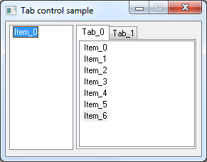

## Description

This is an overview of possible tab control usage options.

## Task

Create tabbed pages in a dialog.

Dialog template:

Each tab contains one control, for example, treeview. There is one control (main treeview) that is placed before tab control on a dialog. This control is the first in the tab order and has focus by default.

## Possible options

According to posts [here](https://devblogs.microsoft.com/oldnewthing/20191015-00/?p=102996) and [here](https://devblogs.microsoft.com/oldnewthing/20211110-00/?p=105889) tab content should be created as tab control siblings, not children.

There are several ways to create tab content:

1. Place all controls in a nested dialog. Dialog is hidden by default. When you select a tab, dialog is displayed. Dialog should have WS_EX_CONTROLPARENT style to allow child controls to be selected by the keyboard.
2. The same as point 1, but the dialog is created when a tab is selected and destroyed when another tab is selected.
3. All controls are created on the main dialog, hidden by default and displayed when a tab is selected.
4. The same as point 3, but all controls are created when a tab is selected and destroyed when another tab is selected.

## Main issue

Now about the main issue: overlapping vs tab order.

It makes sense to create tab content after the tab control, because then we will have the correct tab order, but in this case, the tab control will be above the tab content in z-order, so it will overlap the content controls, in other words, problems will begin:

* tab control will be drawn over content controls; setting WS_CLIPSIBLINGS style for the tab control doesn't fix this situation
* drag-and-drop [will not work](https://devblogs.microsoft.com/oldnewthing/20030826-00/?p=42793) for content controls

On the other hand, if the tab control is placed after the tab content in z-order, there will be no overlap, but now we will have the wrong tab order, because the tab order is based on z-order.

## More details

Now let's talk about variants in more detail. We assume that the tab control is higher in z-order than tab content, otherwise tab order is incorrect. How to fix this will be discussed later.

First about nested dialogs (points 1, 2). When the nested dialog is used, redrawing part of "overlapping vs tab order" problem doesn't occur. The dialog will receive a WM_PAINT message after the tab control when it becomes visible from the WM_INITDIALOG or TCN_SELCHANGE handlers.

Regarding point 2, theoretically, the dialog template can contain WS_VISIBLE style to display the dialog without using ShowWindow, but in this case the dialog will receive WM_PAINT last when the TCN_SELCHANGE handler is executed, the child windows will not receive the WM_PAINT message, so the dialog will be drawn on top of all its children. Most likely it has something to do with the order of WM_PAINT messages during tab selection change. Anyway, the dialog should be hidden during the creation step.

For both points 1, 2 drag-and-drop will not work for child controls.

When the content controls are placed in the main dialog and become visible when a tab is selected, they received WM_PAINT after the tab control, so redrawing problem doesn't occur.

If the content controls are created while changing the tab selection, they, as in the case of nested dialogs, should also be hidden and made visible after creation, otherwise the tab control will receive WM_PAINT last and will be drawn on top of the content controls.

All variants are valid and a specific one should be chosen depending on your needs. The nested dialog variant has an overhead when the tab content consist of only one control.

## Redrawing problem fix

A few words about the redrawing problem.

By default, the tab control from the dialog template has WS_CLIPSIBLINGS style enabled. You can add this style during the tab control creation. According to [docs](https://learn.microsoft.com/en-us/windows/win32/winmsg/window-styles) this style should exclude all sibling areas from window drawing area. In this case, there shouldn't be a redrawing problem at all, but it exists, which means something isn't working as described or I'm doing something wrong.

There is a workaround for the redrawing problem described [here](https://www.virtualdub.org/blog2/entry_291.html). Tab control can be subclassed and all sibling areas can be excluded from drawing area in WM_ERASEBKGND handler before painting.

If areas were excluded in WM_ERASEBKGND handler, then there is no need to exclude them in WM_PAINT, because it uses same DC.

If you still need to exclude areas from WM_PAINT handler, then call BeginPaint to get DC, perform excluding and pass WM_PAINT message to default proc with DC in wParam, otherwise drawing will fail, because BeginPaint can be called once during one drawing stage. According to [docs](https://learn.microsoft.com/en-us/windows/win32/gdi/wm-paint), if wParam is not 0, then control assumes that it is a DC and perform drawing using this DC. The tab control supports this feature.

When visual styles are enabled, excluding from WM_ERASEBKGND or WM_PAINT can be used, but if visual styles are turned off, excluding from WM_ERASEBKGND is mandatory.

## Tab order fix

Finally, how to fix the tab order.

From now on, we use the z-order where tab control goes after the tab contents, which means there are no problems with redrawing and drag-and-drop, but the tab order is incorrect.

[This](https://devblogs.microsoft.com/oldnewthing/20030826-00/?p=42793) z-order rotating trick can help to fix the tab order, but not for current test case. We can't put the tab treeview in front of the tab control in the z-order, because the main treeview has to be there.

There are 2 ways to fix the tab order:

* WH_CBT hook
* Tab key handler

### WH_CBT hook

The WH_CBT hook allows to handle HCBT_SETFOCUS notifications that are sent before the window receives keyboard focus. Notify provides handle to the window that loses focus and window that gains focus. Hook handler can prevent this operation and set the focus to another window. The target window can be retrieved from one of two maps:

* forward (Tab): key - window handle, value - next window handle
* backward (Shift+Tab): key - window handle, value - prev window handle

### Tab key handler

A custom Tab handler should be installed for each control that breaks the tab order.

Control is subclassed. Then the WM_GETDLGCODE handler is implemented, which should return the DLGC_WANTTAB value. This means that the control wants to receive the tab key notifications and will process them itself.

The control can use two window handle values: *prev* and *next*, which are NULL by default. If they are not NULL, the Tab handler should send WM_NEXTDLGCTL message to parent window with *next* value as wParam, if Tab was pressed, or with *prev* value as wParam, if Shift+Tab were pressed. lParam should have TRUE in the low word.

If Tab was pressed and *next* is NULL, the Tab handler should send WM_NEXTDLGCTL with wParam=0. If Shift+Tab were pressed and *prev* is NULL, the Tab handler should send WM_NEXTDLGCTL with wParam=1. lParam should have FALSE in the low word.

Also, WM_CHANGEUISTATE and WM_UPDATEUISTATE messages should be sent to update focus rect.

## Conclusion

I don't know which of these methods is correct way to work with tab controls. Would like to hear your opinion in Discussions or Issues.

Perhaps Raymond Chen will be able to comment on something in his [blog](https://devblogs.microsoft.com/oldnewthing).
